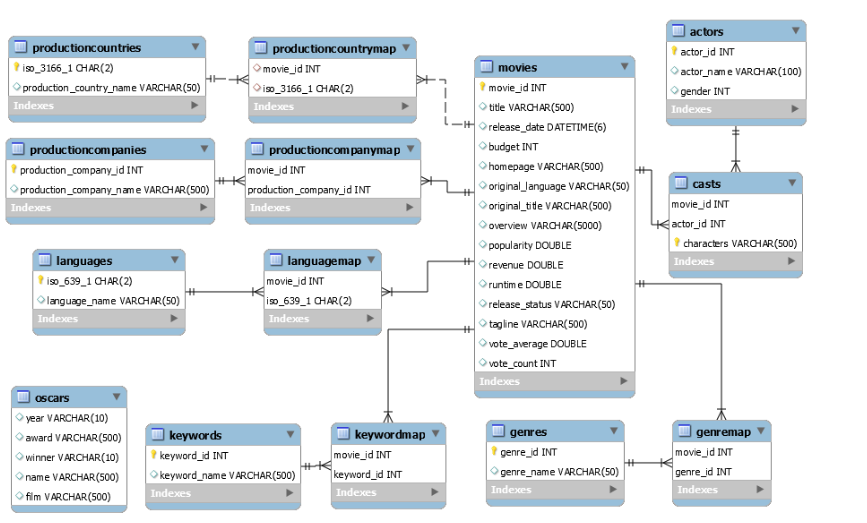

# Movie_database-SQL-exploration

This project is an exploration of a movie database using SQL (SQlite) and Jupyter notebooks, designed to uncover insights about films, genres, actors, and ratings. By analyzing structured data, the project aims to answer interesting questions about the movie industry, such as identifying top-rated movies, exploring trends across different genres, and examining patterns in movie releases over the years.

*Data Source*
This data was sourced from [The movie database tmdb](https://www.themoviedb.org/)

## Entity Realtionship

The TMDb database consists of 12 tables containing information about movies, cast, genre, and so much more.
[Movie database SQL exploration notebook file](SQL_Movie_Exploration.ipynb)
